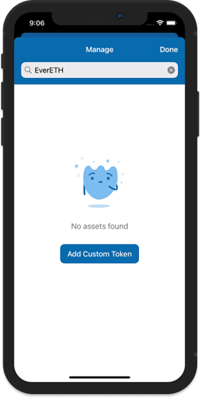
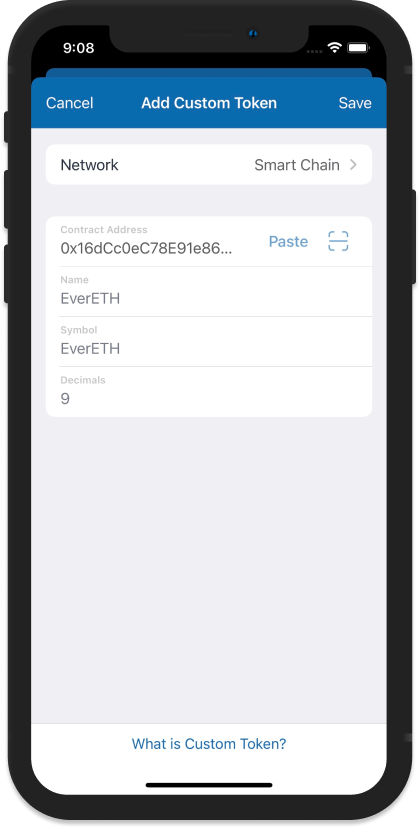

# 📝 How to Add ATH token in Trust Wallet

Tokens are Digital [Assets](https://trustwallet.com/assets) created within the application on a particular blockchain. Trust Wallet supports several blockchains where tokens are being issued. Some examples are **ERC20** on the **Ethereum** Network, **BEP20** on **Binance Smart Chain,** and **SPL** tokens on the **Solana** blockchain.

When a token has been successfully sent to the wallet and it does not appear, it can be manually added as a **Custom Token**. For this guide, we will try to add a **BEP20** token to the **Binance Smart Chain**.

## Step 1. Search for the Token 

Tap on the toggle sign in the upper right corner of the main Wallet screen. Search for the token, and if the token is not available, you will see a “**No Asset Found**” message with an **Add Custom Token** button.

<figure><figcaption></figcaption></figure>

## Step 2. Fill up Token Details 

Tap on **Add Custom Token** button, then make sure that you have selected the correct **Network**. For this guide, we need to select **Smart Chain** on the supported **Network**, since this is a token that resides on the **Binance Smart Chain**.

**ATH Contract address: 0x5597d204118436b5bca397aded5ac6923a26033d**

<figure><figcaption></figcaption></figure>

After pasting or scanning the Contract Address, the other details like the **Name**, **Symbol,** and **Decimals** will be automatically filled up. If not, fill them in manually. Tap on **Save** to continue.

Hope this tutorial helps you solve your problem of not seeing the ATH token in your meta mask and trust wallet. Kindly follow and be active on our social media and community channels.

## Important Resources:

[**Website |** ](https://athenadexfi.io/)[**Twitter |** ](https://twitter.com/AthenaDexFi)[**Telegram |** ](https://t.me/AthenaCryptoBankGroup)[**Medium|** ](https://medium.com/@AthenaDexFi)[**Youtube|** ](https://www.youtube.com/@AthenaDexFi)[**Facebook |** ](https://www.facebook.com/AthenaDexFi)[**Forum**](https://forum.athenacryptobank.io/)

[**Whitepaper**](https://athenacryptobank.io/doc/WHITEPAPER\_ATHENA\_CRYPTO\_BANK.pdf)
