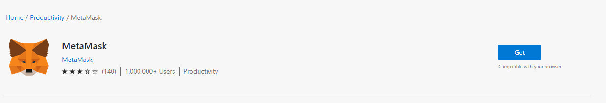
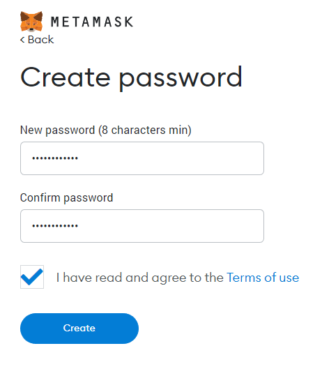
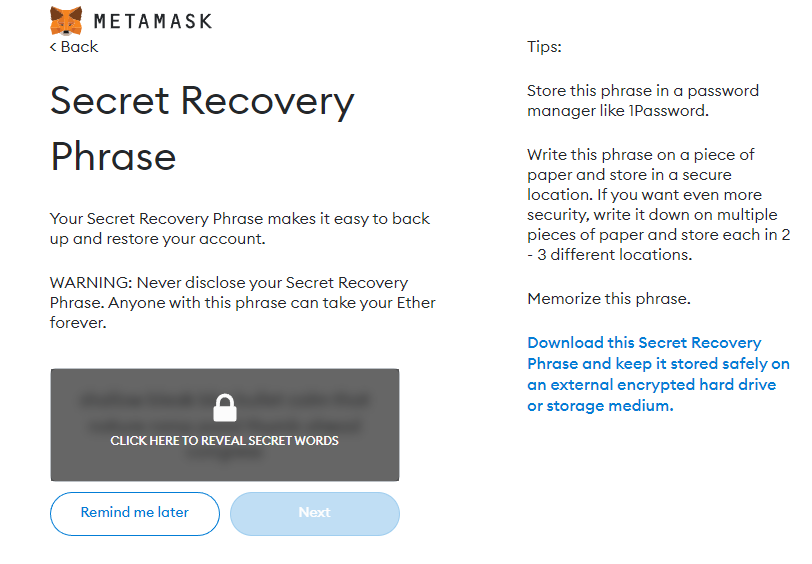

# Metamask Wallet Creation

**Metamask**

**How do I install MetaMask?**

Let's start by simply installing MetaMask as a browser extension. The easiest way is to use one of the supported browsers listed above to navigate to MetaMask.io and click **Download**. For this example, I will browse to MetaMask on Edge, click **Download** and **Install**.

<figure><figcaption></figcaption></figure>

It will open the Edge Add-Ons page. Click **Get** to install and add the extension.

<figure><figcaption>
<strong>The extension will be added to your browser</strong>
</figcaption></figure>

Next, choose to **Create a Wallet**. This will create our hot wallet, which is connected to the internet and always available.

<figure><figcaption></figcaption></figure>

Agree to the Terms of Use to continue and create an eight-character alphanumeric strong password.

<figure><figcaption></figcaption></figure>

Click **Create** and **Next** to display your **secret recovery phase**.

I want to pause here to discuss how important it is to protect your secret recovery phrase or seed phrase. It's the equivalent of handing someone your debit card _and_ PIN number. You would never do this. Someone can have your debit card, but without your PIN number, they have no access. And just like someone having your PIN, someone with access to your secret recovery phase can import your wallet, and at that point, your password is useless. So to be clear:

* Never -- and I mean NEVER -- reveal your secret recovery phrase to anyone.
* Never type it in any email.
* Never give it to a support person.
* Never store it online.
* Never -- EVER -- use it unless you are reinstalling MetaMask, and if you do, always make sure you are going to [MetaMask.io](https://metamask.io/).

<figure><figcaption></figcaption></figure>

After you write down and store the phrase in a secure manner, click **Next** and enter the phrase as shown below.

<figure><figcaption>
<strong>Arrange the words in order</strong>
</figcaption></figure>

Click **Confirm** and **All Done**. You have created a MetaMask wallet.

## Note:

If you have a problem and you want to speak with support, enter Telegram. It can be in English, Italian or Spanish, and tag an admin. Remember, no admin will ask you for money or your private keys.\

**Italian Telegram Link:** [**https://t.me/AthenaDexFi\_it**](https://t.me/AthenaDexFi\_it)\
**Spanish Telegram Link:** [**https://t.me/AthenaDexFi\_es**](https://t.me/AthenaDexFi\_es)

## Important Resources:

[**Website |** ](https://athenadexfi.io/)[**Twitter |** ](https://twitter.com/AthenaDexFi)[**Telegram |** ](https://t.me/AthenaDexFi\_Main)[**Medium|** ](https://medium.com/@AthenaDexFi)[**Youtube|** ](https://www.youtube.com/@AthenaDexFi)[**Facebook |** ](https://www.facebook.com/AthenaDexFi)[**Forum**](https://forum.athenadexfi.io/)
