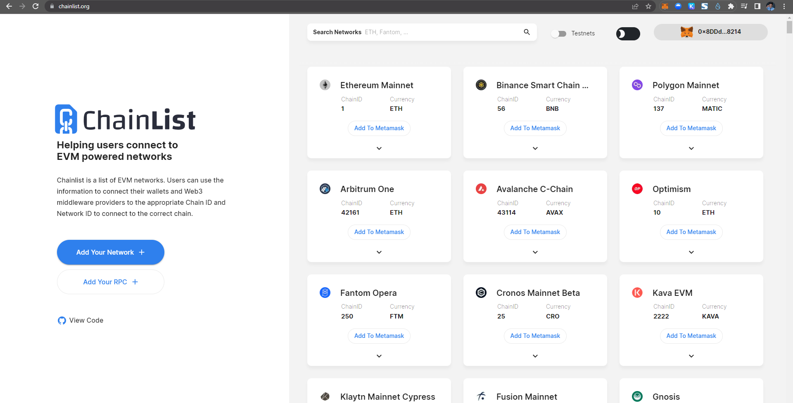
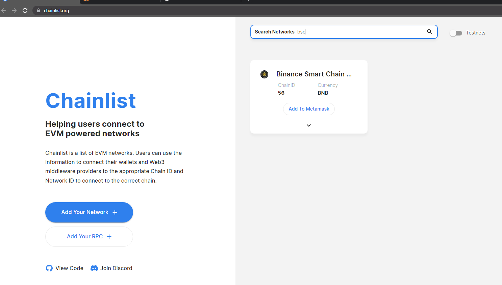
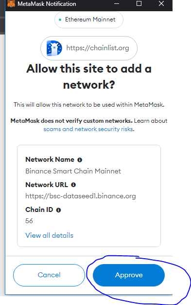
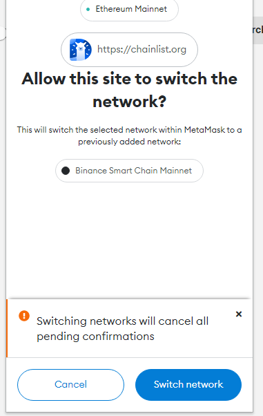
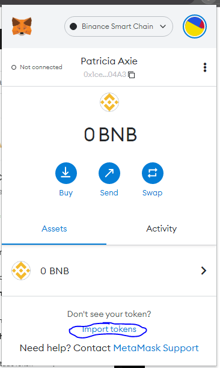
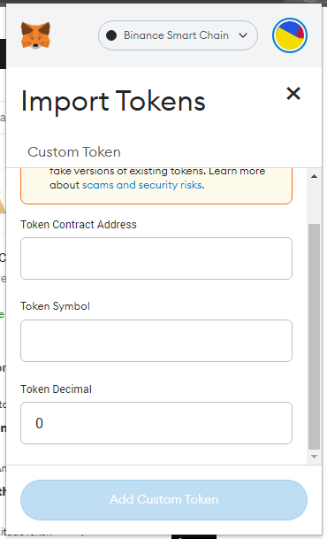

# 🦊 How to add ATH token in Metamask

Athena Token **$ATH** is already released to the wallets of our early investors, if you are having trouble or you can’t see the **ATH** token in your wallet you may find the solution in this medium post.

First, you need to install Metamask and add the binance smart chain. Just go to [https://chainlist.org/](https://chainlist.org/) See the photo below for reference.

<figure><figcaption></figcaption></figure>

**then type on the search bar BSC or binance smart chain.**

<figure><figcaption></figcaption></figure>

**Click add to metamask**

<figure><figcaption></figcaption></figure>

**Then metamask will pop up and you need to approve and switch network to be able to use the binance smart chain.**

<figure><figcaption></figcaption></figure>

<figure><figcaption></figcaption></figure>

After switching to **Binance smart chain** you can now add **Athena DexFi** token or **ATH** on your metamask wallet. See the tutorial below for more info.

**META MASK**

Typically, MetaMask displays ERC-20 standard tokens (or [standard tokens](https://ethereum.org/en/developers/docs/standards/tokens/erc-20/)) you own on your account page. However, with the proliferation of tokens on Ethereum and other networks, MetaMask doesn’t keep an authoritative list — but it does allow you to add any ERC-20-compliant token you hold.

**Choose the BSC network for your metamask**

1. Click on ‘Import tokens’, located at the bottom of the ‘Assets’ tab on your wallet homepage.

<figure><figcaption></figcaption></figure>

2\. Switch to the ‘**Custom token**’ tab at the top, and then enter the token address in the first field. See [below](https://metamask.zendesk.com/hc/en-us/articles/360015489031-How-to-add-unlisted-tokens-custom-tokens-in-MetaMask#h\_01FWKCA7MJG5HT2MSZZ8DJ0QCF) if you don’t know where to find this.

**ATH Contract address is:**

<figure><figcaption></figcaption></figure>

3\. In most cases, the token symbol and token decimal will autofill. Just Click **Add custom token** and you will be able to see your **ATH** tokens.

## Important Resources:

[**Website |** ](https://athenadexfi.io/)[**Twitter |** ](https://twitter.com/AthenaDexFi)[**Telegram |** ](https://t.me/AthenaCryptoBankGroup)[**Medium|** ](https://medium.com/@AthenaDexFi)[**Youtube|** ](https://www.youtube.com/@AthenaDexFi)[**Facebook |** ](https://www.facebook.com/AthenaDexFi)[**Forum**](https://forum.athenacryptobank.io/)

[**Whitepaper**](https://athenacryptobank.io/doc/WHITEPAPER\_ATHENA\_CRYPTO\_BANK.pdf)
