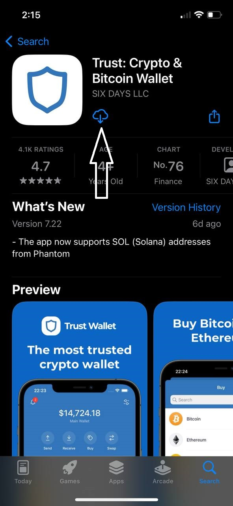
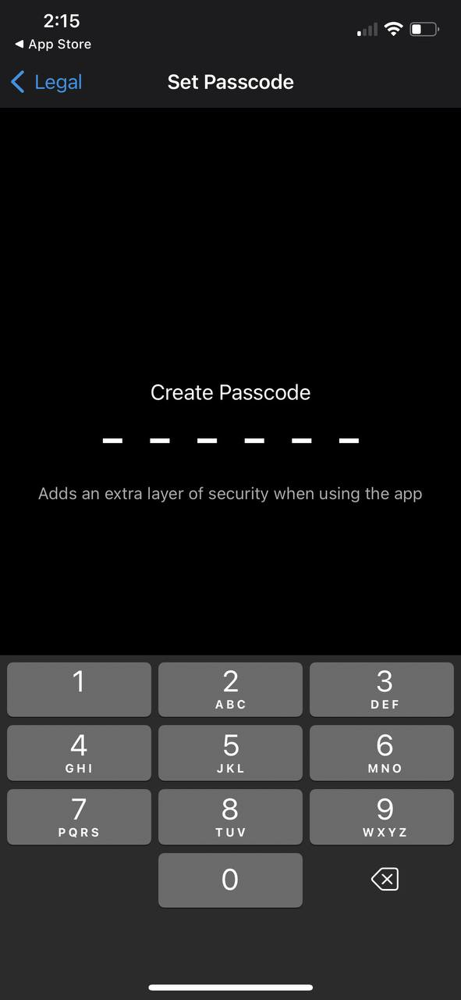
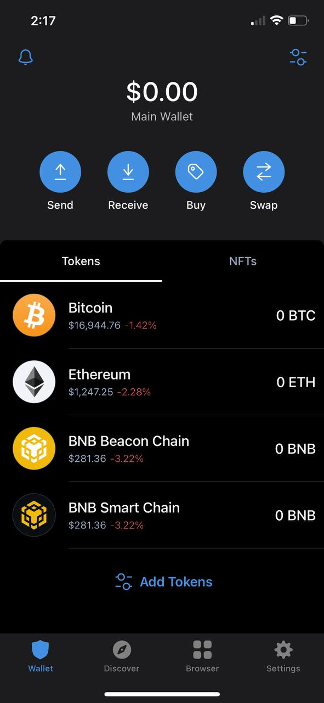

# Trust Wallet Creation

**Trust Wallet**

First, you need to download the trust wallet in Google chrome, Playstore, or App Store depending on your device.

<figure><figcaption>
<strong>Click Install in your mobile phone</strong>
</figcaption></figure>

After you install **Trust Wallet** on your device, open it and select create new wallet

<figure><figcaption>
<strong>Choose create a new wallet if you don't have one</strong>
</figcaption></figure>

After creating a new wallet, you need to check and accept the Privacy Policy and Terms of Service

<figure><figcaption>
<strong>Check the box and click continue</strong>
</figcaption></figure>

After setting checking the terms of service and Privacy Policy, you will be asked to set up your passcode, you will need it every time you open the Trust Wallet App.

<figure><figcaption>
<strong>set your passcode</strong>
</figcaption></figure>

After you set the passcode, you need to back up your wallet, it is advisable to write it down on paper and keep it in a safe place. Check all the warnings and it will show you your backup phrase.

<figure><figcaption>
<strong>After checking just click continue</strong>
</figcaption></figure>

After you click continue you will need to fill up the recovery phrase

<figure><figcaption>
<strong>backup and verify your recovery phrase</strong>
</figcaption></figure>

Congrats! You've successfully created the trust wallet!

**Note:** For all the transactions you will make to Athena Crypto DexFi, You need to confirm it in your trust wallet mobile app, or else it will fail.

<figure><figcaption></figcaption></figure>

## Important Resources:

[**Website |** ](https://athenadexfi.io/)[**Twitter |** ](https://twitter.com/AthenaDexFi)[**Telegram |** ](https://t.me/AthenaDexFi)[**Medium|** ](https://medium.com/@AthenaDexFi)[**Youtube|** ](https://www.youtube.com/@AthenaDexFi)[**Facebook |** ](https://www.facebook.com/AthenaDexFi)[**Forum**](https://forum.athenacryptobank.io/)
