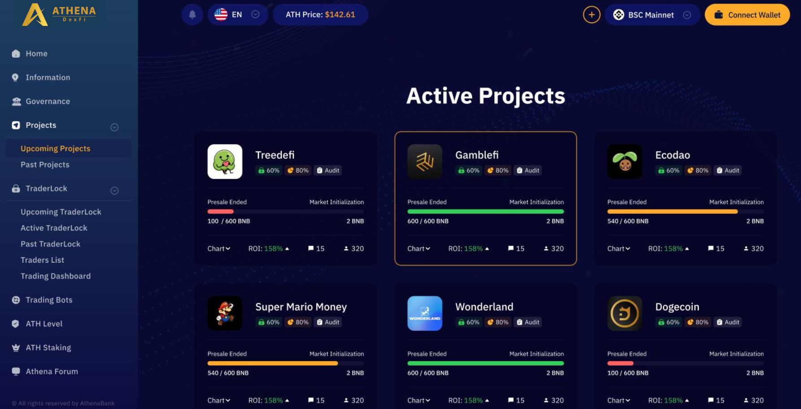
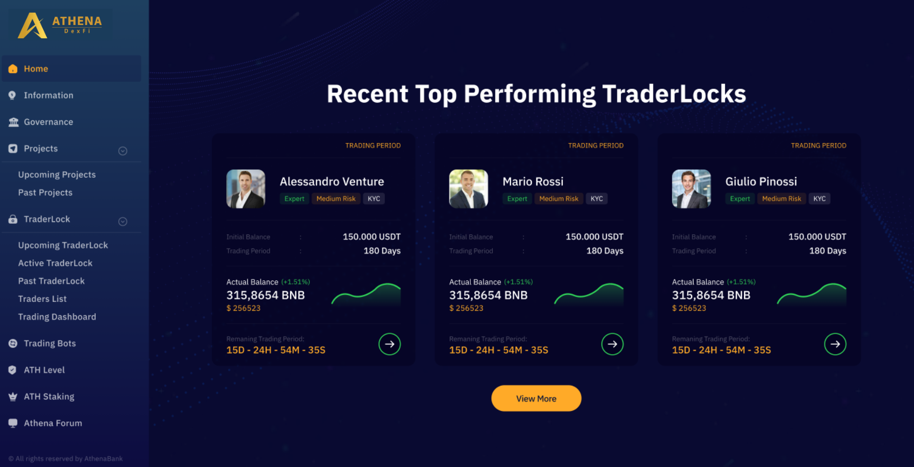
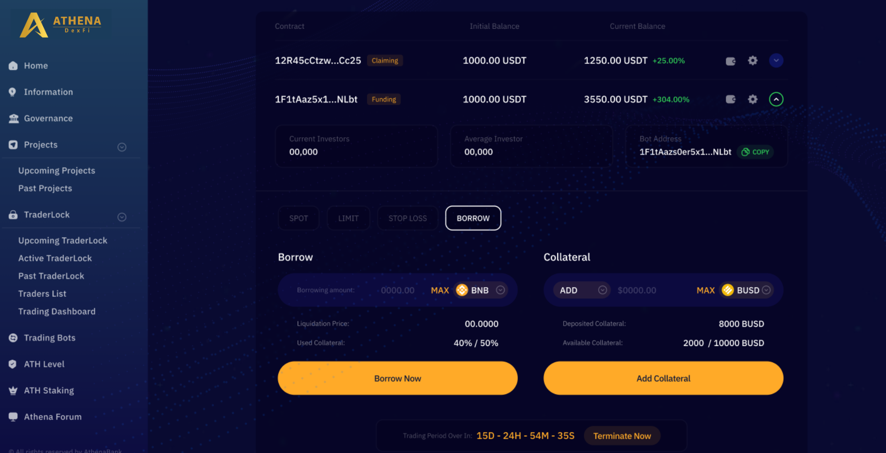

# ⚙ Platform

**Athena DexFi** created a platform in **DEFI** that will allow 100% of new users and experienced traders to:

1. **Participate in upcoming presales that have been researched by the team**

(In the future, we will implement investment opportunities not only limited to crypto but in all aspects of businesses.)

<figure><figcaption></figcaption></figure>

2\. A sort of **copy-trading**, even if it would be more correct to call it **portfolio management** by a trader with a history in the **blockchain**. Traders must respect the rules given by the smart contract so they cannot invest in coins that the client did not know before.

<figure><figcaption></figcaption></figure>

3\. Different innovative tools such as **short integration**, **stop-loss**, **stop-market order**, **lending**, and **borrowing** in **DeFi**

<figure><figcaption></figcaption></figure>

For detailed guide on how to create a trading contract, kindly visit this link below


[Broken link](broken-reference)


## Important Resources:

[**Website |** ](https://athenadexfi.io/)[**Twitter |** ](https://twitter.com/AthenaDexFi)[**Telegram |** ](https://t.me/AthenaDexFi)[**Medium|** ](https://medium.com/@AthenaDexFi)[**Youtube|** ](https://www.youtube.com/@AthenaDexFi)[**Facebook |** ](https://www.facebook.com/AthenaDexFi)[**Forum**](https://forum.athenacryptobank.io/)
