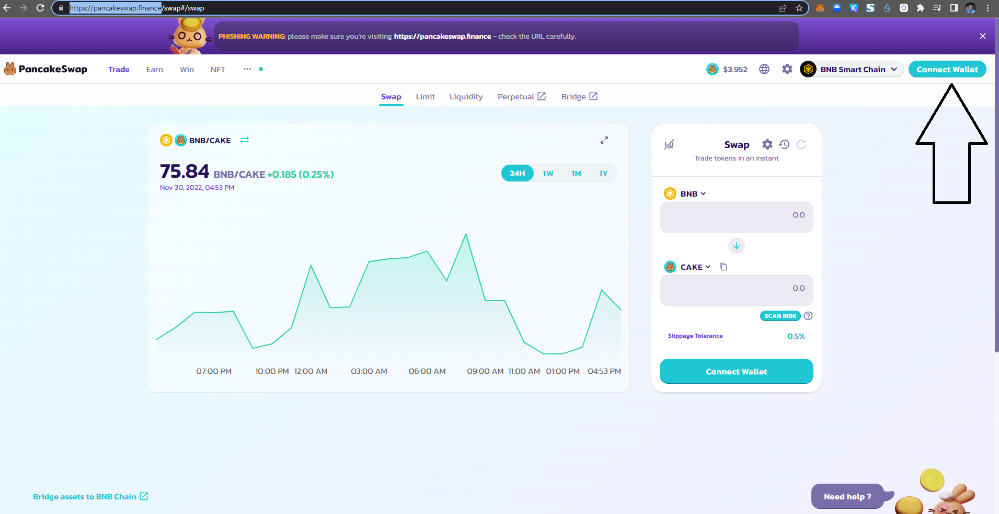
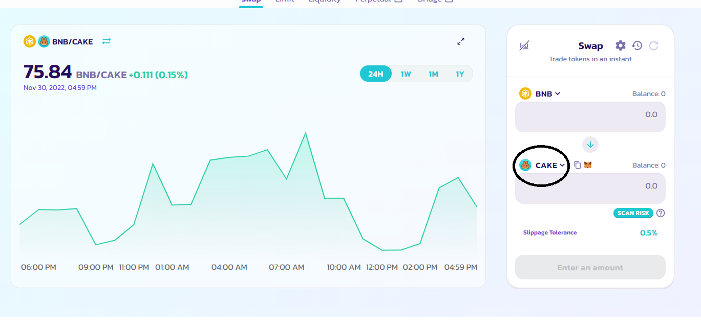
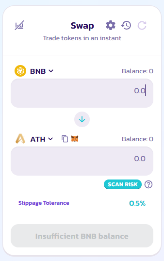

# 🥞 How to buy ATH tokens in Pancakeswap

You can simply go to:

or you can learn the process of adding the token you want to buy below

First, you need to go to [https://pancakeswap.finance/](https://pancakeswap.finance/)

Then connect your wallet

**Note:** You need to have a BNB balance in your wallet in order to buy $ATH token.

<figure><figcaption></figcaption></figure>

After you connect your wallet, you need to go to [https://pancakeswap.finance/swap](https://pancakeswap.finance/swap)

Then click the encircled image below

<figure><figcaption></figcaption></figure>

After clicking the encircled image above, it will show you a list of tokens available, you need to paste the contract address of the **Athena DexFi** token in order for it to show.

**$ATH** CONTRACT ADDRESS\*\*: Blank\*\* this is the address you need to input in the search box

(photo here)

After clicking import it will show another confirmation you just need to check the I understand box and click Import

(photo here)

When the liquidity is ready and available you are now able to purchase ATH tokens using pancakeswap. Just input the BNB amount you want and click swap at the bottom and confirm on your metamask wallet.

<figure><figcaption></figcaption></figure>

I hope you learn how to purchase **ATH** tokens using pancakeswap.

## Important Resources:

[**Website |** ](https://athenadexfi.io/)[**Twitter |** ](https://twitter.com/AthenaDexFi)[**Telegram |** ](https://t.me/AthenaDexFi)[**Medium|** ](https://medium.com/@AthenaDexFi)[**Youtube|** ](https://www.youtube.com/@AthenaDexFi)[**Facebook |** ](https://www.facebook.com/AthenaDexFi)[**Forum**](https://forum.athenacryptobank.io/)
