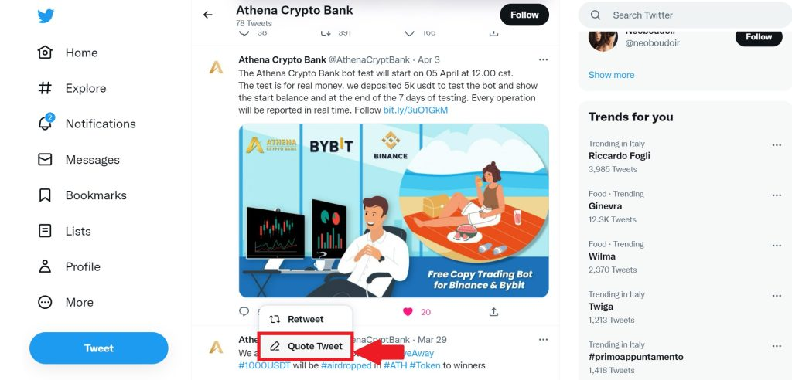

# 📊 CEX Copy Trading

## Tutorial for ACB Bot Copy Trading in CEX

To participate in **Athena DexFi** copy trading you will need to follow these steps.

Create a bybit account, if you don’t have one use our referral link to save on commissions: [**https://partner.bybit.com/b/SatGroup**](https://partner.bybit.com/b/SatGroup)

**1- Once you have created your Bybit account, create a sub-account:**

<figure><figcaption></figcaption></figure>

**2-** **Create a sub-account and select standard**

<figure><figcaption></figcaption></figure>

**3- Give a name**

<figure><figcaption></figcaption></figure>

**4- Created the account go to create API and create an API key**

<figure><figcaption></figcaption></figure>

**5- Select all points except wallet. Don’t worry they will only manage the money inside this sub-account and will not be able to make withdrawals. (remember to select: read-write)**

<figure><figcaption></figcaption></figure>

**6- Once pushed forward it will give you the public key and secret key. Copy the keys to a safe place like this to be able to connect this account to the bot. (the keys will no longer be visible at a later time)**

<figure><figcaption></figcaption></figure>

**7- Once the sub-account has been created and we have the keys, we have to move part of our funds there. Select transfer assets to send from our main account to the account with the name that we chose directly on derivatives. Select USDT and the amount you would like to use.**

<figure><figcaption></figcaption></figure>

**8- Remember that you will be able to see the operations on your sub-account by pushing on the account switch to go to your sub-account. You can also switch from the mobile application. You will find it at the bottom**

<figure><figcaption></figcaption></figure>

**9- Then you will be asked for your Twitter, if you don’t have it you will have to. Like this post, leave a comment, and “Quote Tweet” by inserting this text: I am happy to try the #Copytrading #Bybit #bot. #AthenaDexFi: No monthly fees, commissions only on profits.**

<figure><figcaption></figcaption></figure>

**10- Now choose the trader or bot to copy to Athena DexFi and select it. You will be redirected to the public Telegram channel. In the description of the telegram channel, you will find the name of the bot to contact to connect your Bybit account. You will be asked for the email you linked to Athena DexFi, your Twitter, and your metamask wallet which you used to register on their site. They will only charge you commissions based on the profit generated, based on your ATH level. If you are not registered with Athena, you can still try the bot, but you will have to enter the correct data and retweet the post.**

<figure><figcaption></figcaption></figure>

**Note: These are the commissions based on the level, see the link below for more info:**


[ath-token-levels](ath-token-levels/)


## Important Resources:

[**Website |** ](https://athenadexfi.io/)[**Twitter |** ](https://twitter.com/AthenaDexFi)[**Telegram |** ](https://t.me/AthenaDexFi)[**Medium|** ](https://medium.com/@AthenaDexFi)[**Youtube|** ](https://www.youtube.com/@AthenaDexFi)[**Facebook |** ](https://www.facebook.com/AthenaDexFi)[**Forum**](https://forum.athenacryptobank.io/)
