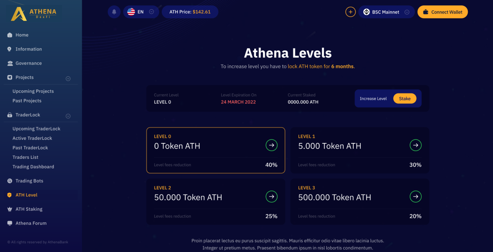

# 🚀 Invest in Presale Contracts

First, you need to connect your wallet to the **Athena DexFi Platform,** if you don't know how to do that please go to this link where we teach how to connect your wallet using **metamask** or **Trustwallet**.


[trust-wallet-connect-to-athena-platform.md](../../general-knowledge/wallet/trust-wallet-creation/trust-wallet-connect-to-athena-platform.md)



[metamask-connect-to-athena-platform.md](../../general-knowledge/wallet/metamask-wallet-creation/metamask-connect-to-athena-platform.md)


After you connect your wallet, you have the option to **stake** your **ATH** token if ever you already have one, to be **prioritized** in buying the **presale** of active projects and have fewer fees. Don't worry if you don't have an **ATH** token you can still participate in the presale, as I will explain at the bottom of this page.

If you don't have an **ATH** token please see the link below on how to buy in pancakeswap


[how-to-buy-ath-tokens-in-pancakeswap.md](../../general-knowledge/how-to-buy-ath-tokens-in-pancakeswap.md)


Go to [https://athenadexfi.com/athenalevel](https://athenadexfi.com/athenalevel) and click **Approve**

<figure><figcaption></figcaption></figure>

After you approve, you need to give permission to your wallet, just click **confirm.**

<figure><figcaption></figcaption></figure>

After confirming you can see how much you can stake on different Levels,

<figure><figcaption></figcaption></figure>

After you stake your ATH token you can now participate in the presale on the **Athena DexFi** Platform: [https://athenadexfi.com/activeproject](https://athenadexfi.com/activeproject)

If you staked Level 3 on **Athena LEVELS** you can already purchase the presale, but don't worry if you don't stake a token you can see the red message, it shows how many days or hours you need to wait in order to participate in the presale even if you hold 0 **ATH token.**

<figure><figcaption></figcaption></figure>

Here you can see the list of the active and past projects.

<figure><figcaption></figcaption></figure>

<figure><figcaption></figcaption></figure>

When the time comes, you will be able to Participate in the presale even without staking ATH token, you just need to have **BUSD or BNB** in your wallet for contribution and fees.

<figure><figcaption></figcaption></figure>

During this period, you have the opportunity to contribute to the project being researched by the Athena team. To participate, simply click the "Participate" button and input the amount you wish to invest in the active project.

<figure><figcaption></figcaption></figure>

During this period, you can claim the tokens you invested in during the funding period. The amount of tokens you receive through vesting depends on the specific token project's policy for token release.

<figure><figcaption></figcaption></figure>

Once you claim the tokens, they will be automatically deposited into your wallet and can be traded on any decentralized finance (DEFI) exchanges.

You can see all the info about the project that will be launched on the platform like the whitepaper, team, **Athena** research, and their community. We hope this tutorial helps you to understand how to participate in the Athena platform presale.

## Important Resources:

[**Website |** ](https://athenadexfi.io/)[**Twitter |** ](https://twitter.com/AthenaDexFi)[**Telegram |** ](https://t.me/AthenaDexFi)[**Medium|** ](https://medium.com/@AthenaDexFi)[**Youtube|** ](https://www.youtube.com/@AthenaDexFi)[**Facebook |** ](https://www.facebook.com/AthenaDexFi)[**Forum**](https://forum.athenacryptobank.io/)
