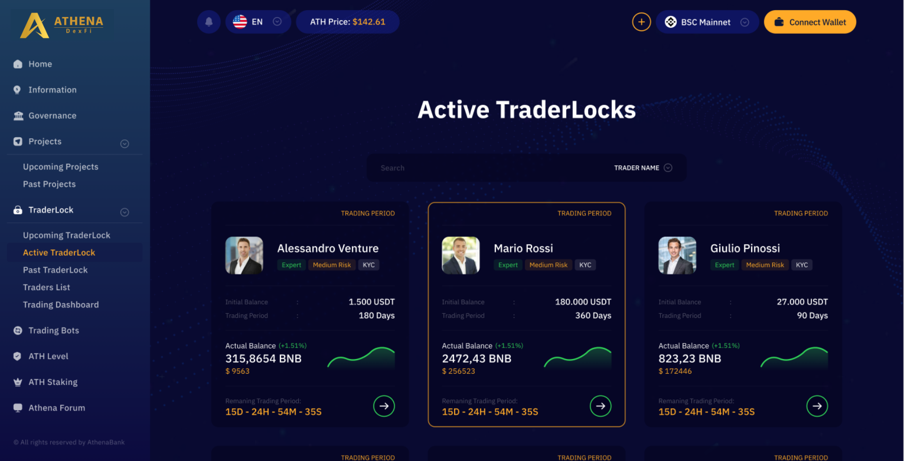
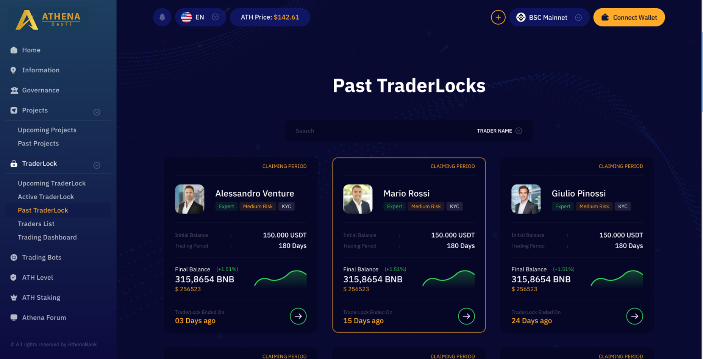
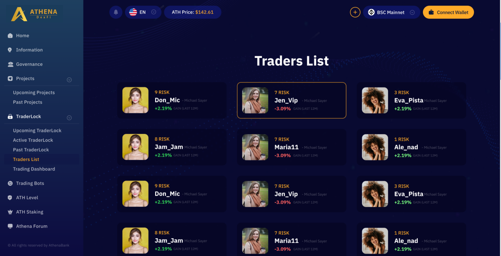
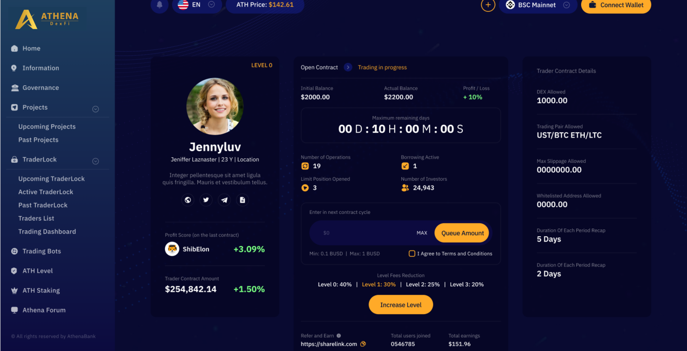
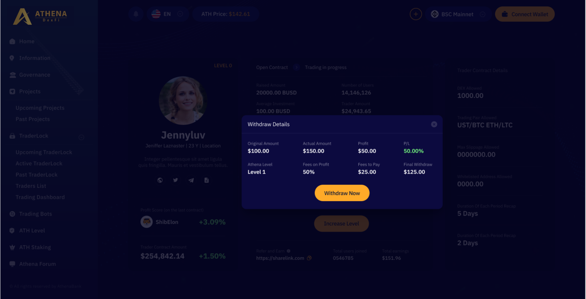

# 📔 Invest in Trader Contracts

<figure><figcaption></figcaption></figure>

The Active TraderLocks page is where users can view the current and ongoing trading contracts available for participation. It allows users to see the active contracts they can join and take part in.

<figure><figcaption></figcaption></figure>

Past TraderLocks is a section where users can view previous trading contracts. By accessing this feature, users can gain insight into the performance of specific traders or contracts, helping them make informed decisions about whether to participate in a particular trading contract.

<figure><figcaption></figcaption></figure>

Traders List section is where the users can see the profitability of all the traders in the athena DexFi platform.

<figure><figcaption></figcaption></figure>

This is the trading contract, you can participate by queueing an amount and when the remaining days has ended. You can automatically participate in this traders trading contract.

<figure><figcaption></figcaption></figure>

In this page, as you can see the user will withdraw in a profit. The user will only pay in Athena platform from his profit. For this case, the user is only Level 1 Athena user, thats why he will pay 50% of his/her profits to the platfrom. If the contract the user participated in is at a loss, the user won't pay any fees.

If you want to learn more about Athena levels, please visit this link below


[ath-token-levels.md](ath-token-levels.md)


## Important Resources:

[**Website |** ](https://athenadexfi.io/)[**Twitter |** ](https://twitter.com/AthenaDexFi)[**Telegram |** ](https://t.me/AthenaDexFi)[**Medium|** ](https://medium.com/@AthenaDexFi)[**Youtube|** ](https://www.youtube.com/@AthenaDexFi)[**Facebook |** ](https://www.facebook.com/AthenaDexFi)[**Forum**](https://forum.athenacryptobank.io/)
