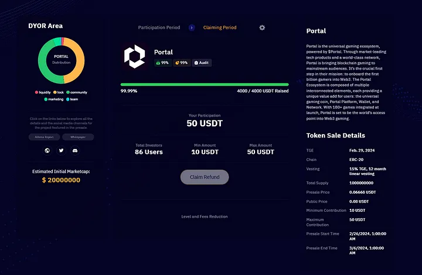
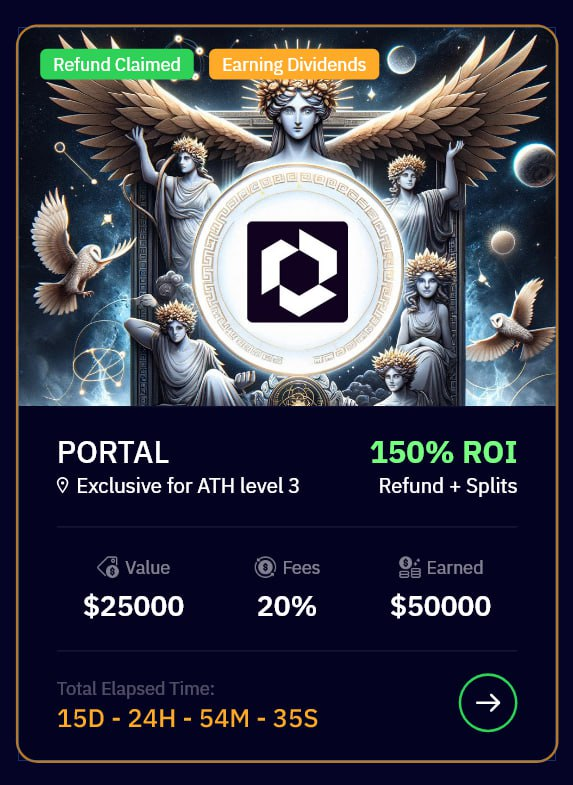

# 🖼️ Participation NFT

## **Understanding the Athena Participation NFT**

1. **What does it represent?**

The Athena Participation NFT is more than just a digital token; it is a representation of your active involvement in projects hosted on Athena DexFi. This NFT serves as a tangible record of your participation, providing proof of your engagement in presale events conducted on the platform. It symbolizes your contribution to the growth and success of projects within the Athena DexFi ecosystem. You need to claim your Participation NFT to refund your initial investment and earn from the future profits of the presale.

2\. **How to claim the refund?**

First, you need to claim your participation NFT before you are able to claim the refund (Initial Investment). You can follow the guide in the link below on how to claim your Participation NFT

### Learn how to claim your Participation NFT here:


[how-to-claim-participation-nft.md](how-to-claim-participation-nft.md)


Claiming a refund with your Athena Participation NFT is a straightforward process. Once a presale concludes, navigate to the Athena DexFi platform and locate the specific presale page. Follow the prescribed steps to claim your NFT, ensuring you have the necessary details and confirmation. This action opens the door to reclaiming your initial investment and positions you to benefit from potential profits generated during the presale.

<figure><figcaption></figcaption></figure>

**2.1 When can you claim your refund?**

After the tokens are launched in the market and the administrator has successfully sold them, a crucial step follows. The administrator will inject the initial investments made by all users back into the contract. This strategic move allows users to then proceed and claim their refund. In essence, this process ensures that participants have the opportunity to recoup their initial investments after the tokens have been introduced to the market and sold.

**3.** **How does the NFT generate income?**

The NFT generates income through a distinctive process. Upon claiming the Participation NFT, participants unlock a revenue stream originating from the presale. Here’s how it works: when a trader realizes gains and injects the resulting profit into the contract, the NFT holders become beneficiaries. The distribution of this profit is proportional, depending on the percentage of the initial amount they contributed to the presale.

It’s important to note that the Athena DexFi platform itself also earns a portion of the profits. The percentage earned by the platform varies according to the user’s level. This tiered structure adds another layer of complexity to the income generation process, which I will delve into in the next part of the explanation.

<figure><figcaption></figcaption></figure>

**How does the fees calculated?**

Athena DexFi employs a transparent fee structure, soon to be further enhanced with the launch of its native token **$ATH**. One key utility of this token is the reduction of fees on user profits derived from presale investments. The Athena DexFi Platform operates with four distinct levels, each correlating to a specific fee rate. The higher your level, the lower the fees deducted from your profits.

**Example:**

Suppose a user has invested $1,000 USD in a presale. After successfully claiming the Participation NFT and initiating the refund process, the user now holds a tangible representation of their involvement in the project.

As the project progresses, and the administrator realizes gains from trading activities, these profits are injected into the contract. Since the user holds the Participation NFT, they become entitled to a share of these profits. In this case, let’s assume the user’s share in the profit amounts to $1,000.

Now, considering the user is at Level 0 in the Athena DexFi platform, the fee structure comes into play. According to the specified fees, 50% of the user’s share, which is $500 (50% of $1,000), goes to the Athena platform. The remaining $500 is sent directly to the user’s wallet.

In summary, for this user at Level 0:

* Total Profit Share: $1,000
* Athena DexFi Platform Fee (50%): $500
* User’s Net Profit: $500

This tiered fee structure not only provides users with a direct return on their investments but also introduces a mechanism where the Athena platform earns a percentage of the profits, further contributing to the sustainability and growth of the ecosystem.

**For more info about Athena Token Levels:**


[ath-token-levels.md](../ath-token-levels.md)


**5. Can I sell my NFT?**

Absolutely! Athena Participation NFTs are tradable assets. Once claimed, you have the flexibility to sell or transfer your NFT to other users. This opens up opportunities to engage in the secondary market, where the value of NFTs can fluctuate based on market demand and the success of associated projects. Ensure you are familiar with the marketplace or platform where you intend to sell your NFT and follow the necessary steps for a secure and efficient transaction. Understanding the Athena Participation NFT empowers you to make informed decisions, capitalize on potential earnings, and actively engage in the dynamic world of decentralized finance. Stay informed, claim your NFT, and explore the possibilities within the Athena DexFi ecosystem. 🚀 #AthenaDexFi #ParticipationNFT #CryptoInvesting”

For info about **Athena DexFi** and the **Presale** visit our [**Telegram**](https://t.me/AthenaDexFi\_Group)

[**Website** ](https://athenadexfi.io/)| [**Facebook** ](https://www.facebook.com/AthenaDexFi)**|** [**Instagram** ](https://www.instagram.com/athenadexfi/)**|** [**Twitter**](https://twitter.com/AthenaDexFi) **|** [**Medium**](https://medium.com/@AthenaDexFi)

[**Youtube** ](https://www.youtube.com/@AthenaDexFi)**|** [**Linkedin**](https://www.linkedin.com/company/athenadexfi/)
