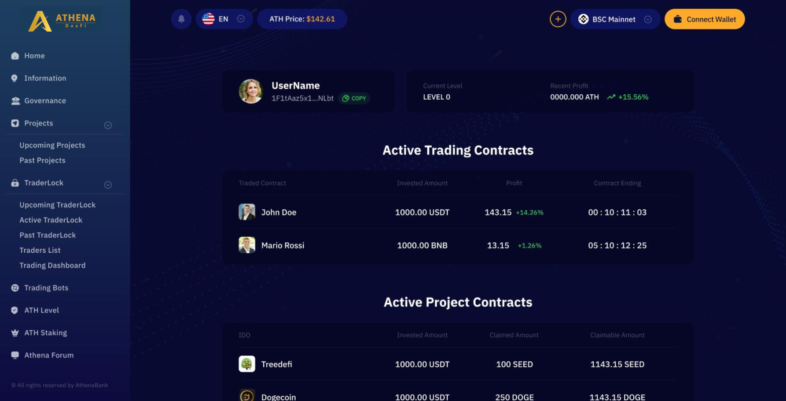
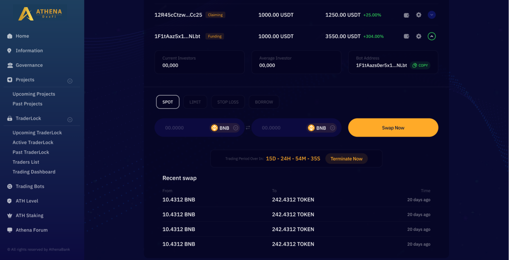
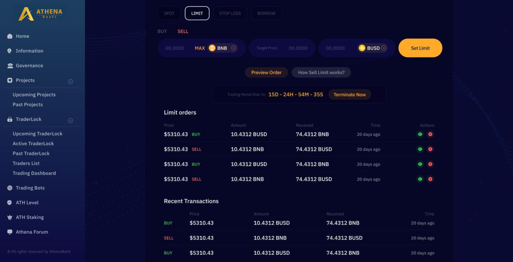
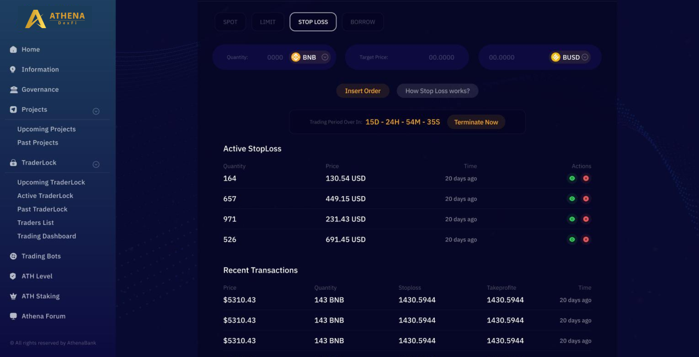
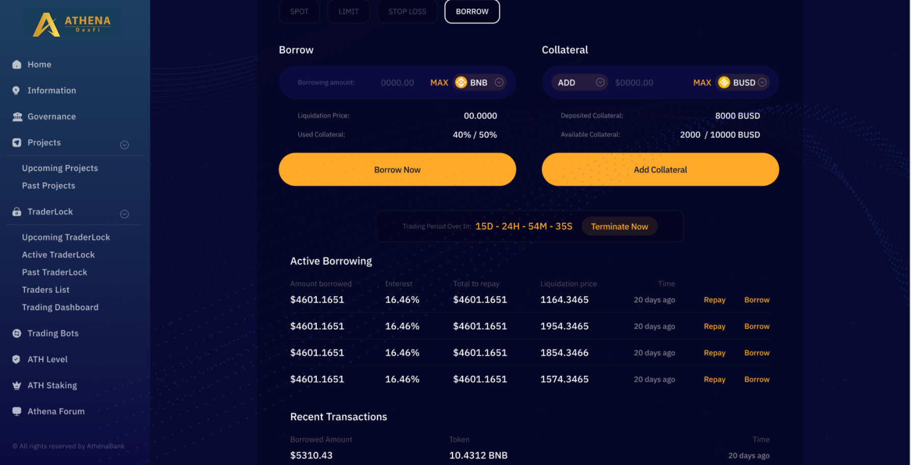

# 📊 Trader Dashboard

<figure><figcaption></figcaption></figure>

In the trading dashboard, you can see all of the trading contracts, active projects, past projects that you participated into.

<figure><figcaption></figcaption></figure>

In this page the trader can manage and perfrom the swap of tokens that he setup on the trading contract that he/she created. The trader can also see the recent transactions.

<figure><figcaption></figcaption></figure>

In this page the trader can view and manage all the limit orders he/she will set. The trader can also see the recent transactions.

<figure><figcaption></figcaption></figure>

In this page the trader can view and manage all the stop-loss he/she will set. The trader can also see the recent transactions.

<figure><figcaption></figcaption></figure>

In this page the trader can view and manage all borrow and collateral he/she will use. The trader can repay and borrow in this page, trader can also see the recent transactions.

## Important Resources:

[**Website |** ](https://athenadexfi.io/)[**Twitter |** ](https://twitter.com/AthenaDexFi)[**Telegram |** ](https://t.me/AthenaDexFi)[**Medium|** ](https://medium.com/@AthenaDexFi)[**Youtube|** ](https://www.youtube.com/@AthenaDexFi)[**Facebook |** ](https://www.facebook.com/AthenaDexFi)[**Forum**](https://forum.athenacryptobank.io/)
