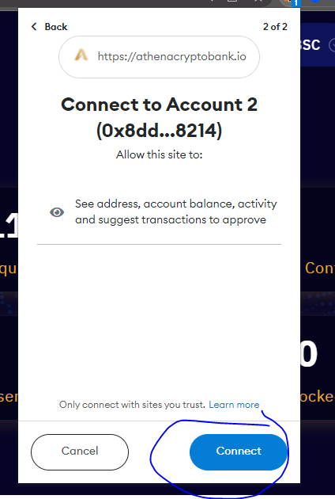
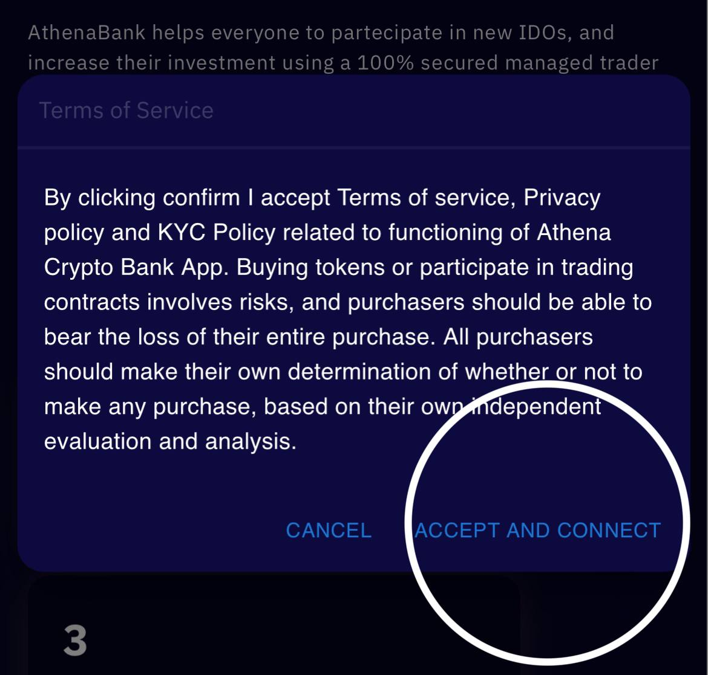
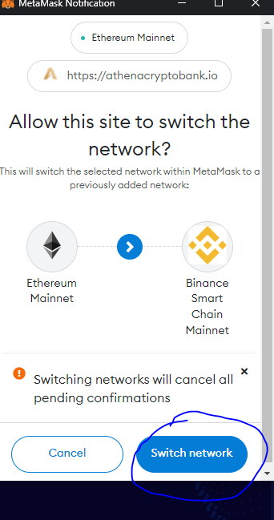

# Metamask Connect to Athena Platform

First, you need to go to the **Athena DexFi** [Website](https://athenadexfi.com/)

<figure><figcaption>
<strong>Click the connect wallet button on the upper right corner of the page</strong>
</figcaption></figure>

You need to choose **Wallet Connect** and you will see all the wallets supported by Athena Platform, go and choose **Metamask**

<figure><figcaption></figcaption></figure>

After clicking **metamask**, click **connect**

<figure><figcaption></figcaption></figure>

After clicking **connect** button, the terms of service will pop up and you need to click **accept and connect**

<figure><figcaption></figcaption></figure>

If this is your first time connecting and using the trust wallet, you need to switch the network to **Binance Smart Chain**.

<figure><figcaption></figcaption></figure>

You need to add and switch Binance Smart Chain on your metamask

After switching, and approving BNB Smart Chain, Congrats! you are now connected to the **Athena DexFi** Platform

## Important Resources:

[**Website |** ](https://athenadexfi.io/)[**Twitter |** ](https://twitter.com/AthenaDexFi)[**Telegram |** ](https://t.me/AthenaDexFi)[**Medium|** ](https://medium.com/@AthenaDexFi)[**Youtube|** ](https://www.youtube.com/@AthenaDexFi)[**Facebook |** ](https://www.facebook.com/AthenaDexFi)[**Forum**](https://forum.athenacryptobank.io/)
