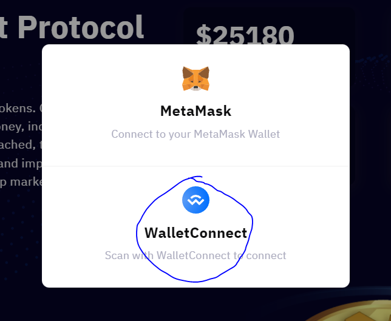
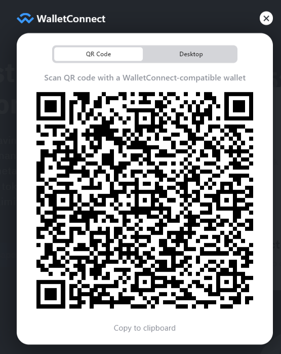

# Trust Wallet Connect to Athena Platform

First, you need to go to the **Athena DexFi** [Website](https://athenadexfi.com/)

<figure><figcaption>
<strong>Click the connect wallet button on the upper right corner of the page</strong>
</figcaption></figure>

After clicking **connect wallet,** you need to choose **WalletConnect**.

<figure><figcaption></figcaption></figure>

After clicking **WalletConnect** the system will show you a **QR code** that you need to scan with your trust wallet or safepal wallet.

<figure><figcaption></figcaption></figure>

Open your trust wallet or safepal wallet and go to settings and scan the **QR code**

<figure><figcaption>
<strong>Go to trustwallet settings, in safepal you can access the qr scanner at the upper right corner</strong>
</figcaption></figure>

After scanning the QR code this will show you the connect button, but you need to first replace the **Ethereum main wallet** with **Binance smart chain and** then connect.

<figure><figcaption>
<strong>Click the main wallet</strong>
</figcaption></figure>

<figure><figcaption>
<strong>Choose BNB Smart Chain</strong>
</figcaption></figure>

<figure><figcaption>
<strong>Then Click Connect</strong>
</figcaption></figure>

After connecting the website will show you the terms and services you need to click **accept and connect**

<figure><figcaption></figcaption></figure>

After clicking accept and connect you need to click agree in your safepal or Trustwallet to confirm

<figure><figcaption></figcaption></figure>

Congrats! you are now connected to the **Athena DexFi** Platform

## Important Resources:

[**Website |** ](https://athenadexfi.io/)[**Twitter |** ](https://twitter.com/AthenaDexFi)[**Telegram |** ](https://t.me/AthenaDexFi)[**Medium|** ](https://medium.com/@AthenaDexFi)[**Youtube|** ](https://www.youtube.com/@AthenaDexFi)[**Facebook |** ](https://www.facebook.com/AthenaDexFi)[**Forum**](https://forum.athenacryptobank.io/)
