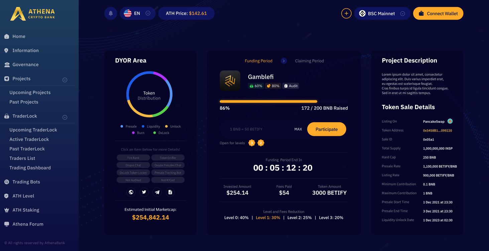
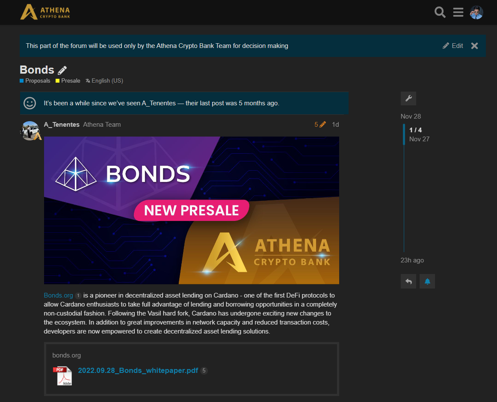

# 📚 Research


The **Athena DexFi** Research team is dedicated and making sure that every project that will be launched in the **Athena Platform** is safe and profitable.


<figure><figcaption>
<strong>Sample of a project in Athena Platform</strong>
</figcaption></figure>

All of the **projects** that will be accessible on the **Athena Platform** are researched carefully by **Athena DexFi** Research Team with an **overall rating** derived from the **utility,** **hype,** and **risk** analysis (**scale: percentage**). Each project compromises a high-level summary, highlighting **key features** and **tokenomics insight** crucial to making an **informed investment decision**. Users have access to a wealth of summarised information including the **Whitepaper**, **Website**, **Telegram/Discord,** and the **team’s background**. Additionally, verified project links are provided to allow members to conduct further **due diligence**.&#x20;

**Athena DexFi** also has a forum where the community can share ideas regarding specific projects whether they think it's a good or a bad investment. With the help of this forum, we minimize the risk and maximize the strength and knowledge of our community.

You can visit the forum at this link: [https://forum.athenacryptobank.io/](https://forum.athenacryptobank.io/)

<figure><figcaption>
<strong>Sample of a project in our forum</strong>
</figcaption></figure>

## Important Resources:

[**Website |** ](https://athenadexfi.io/)[**Twitter |** ](https://twitter.com/AthenaDexFi)[**Telegram |** ](https://t.me/AthenaCryptoBankGroup)[**Medium|** ](https://medium.com/@AthenaDexFi)[**Youtube|** ](https://www.youtube.com/@AthenaDexFi)[**Facebook |**  ](https://www.facebook.com/AthenaDexFi)[**Forum**](https://forum.athenacryptobank.io/)

[**Whitepaper**](https://athenacryptobank.io/doc/WHITEPAPER\_ATHENA\_CRYPTO\_BANK.pdf)

